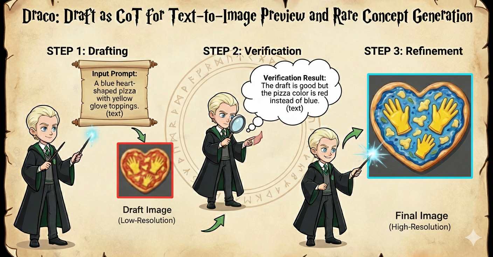

# 🎩 DraCo: Draft as CoT for Text-to-Image Preview and Rare Concept Generation

Official repository for the paper "[DraCo: Draft as CoT for Text-to-Image Preview and Rare Concept Generation]()".

[[📖 Paper](https://arxiv.org/pdf/2512.05112)] [[🤗 Model](https://huggingface.co/CaraJ/DraCo)]

      

## 💥 News
- **[2025.12.05]** We release the [arxiv paper](https://arxiv.org/pdf/2512.05112). Code is coming soon. 🔥

## 🪄 Draft Before Generation

      

We propose **Draft-as-CoT _(DraCo)_**, a novel interleaved reasoning paradigm that fully leverages both textual and visual contents in CoT for better planning and verification. 

Our method 🎨 **first generates a low-resolution draft image as a preview**, providing more concrete and structural visual planning and guidance. 

Then, we 🔎 **employ the model’s inherent understanding capability to verify potential semantic misalignments** between the draft and input prompt, and 🖼️ **perform refinement through selective corrections with superresolution**.

## 🧠 Related Work

Explore our additional research on **Autoregressive Text-to-Image Generation** and  **CoT Reasoning** 

- **[T2I-R1]** [T2I-R1: Reinforcing Image Generation with Collaborative Semantic-level and Token-level CoT](https://arxiv.org/pdf/2505.00703)
- **[ULMEvalKit]** [ULMEvalKit: One-Stop Eval ToolKit for Image Generation](https://github.com/ULMEvalKit/ULMEvalKit)
- **[Echo-4o]** [Echo-4o: Harnessing the Power of GPT-4o Synthetic Images for Improved Image Generation](https://arxiv.org/pdf/2508.09987)
- **[Image Generation CoT]** [Can We Generate Images with CoT? Let's Verify and Reinforce Image Generation Step by Step?](https://arxiv.org/pdf/2501.13926)
- **[Awesome-Nano-Banana-images]** [An Image Gallery Collecting Prompts to Create Stunning Images with Nano-banana](https://github.com/PicoTrex/Awesome-Nano-Banana-images)
